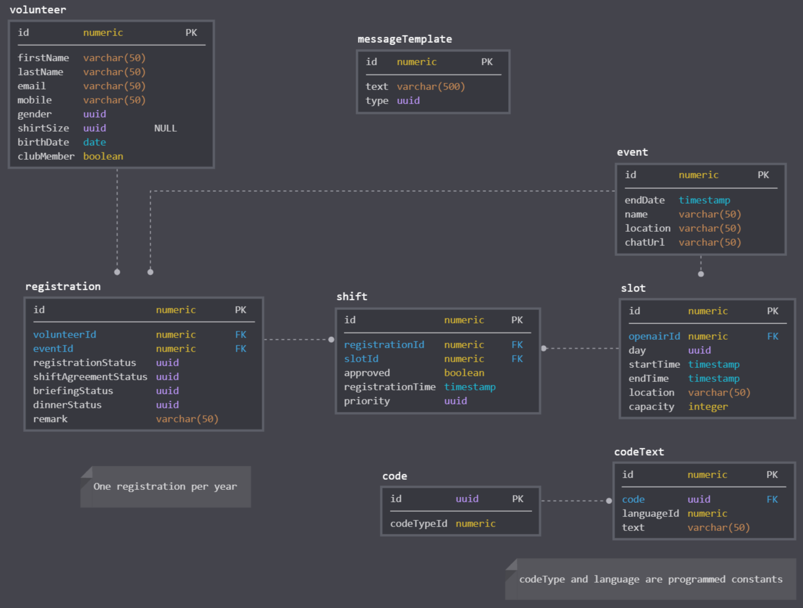

# Volunteer Manager

The volunteer manager should help to coordinate shifts of registered volunteers. It should support automatically generated shift plans which are sent over an email or mobile API (or statically accessible over a web link).

### Features
- Multi language support (i18n)

### Toolstack

- Kotlin
- Spring Boot Application with Thymeleaf Frontend
- Postgres DB
- JQuery 
- Bootstrap, Datatables

## Development
1. Import project in IntelliJ IDEA
2. Start Postgres db with `docker-compose up -d`
3. Configure auto reload of thymeleaf templates in IntelliJ
    - File > Settings > Build, Execution, Deployment > Compiler > Check "Build project automatically"
    - CTRL + SHIFT + A > type "registry" > Find and check "compiler.automake.allow.when.app.running"

## Feature Ideas

### Digital Food Voucher
Each volunteer is given a computed amount of food vouchers. The vouchers are accessible through the volunteer dashboard in form of a QR-code. Once scanned the voucher redeemed.